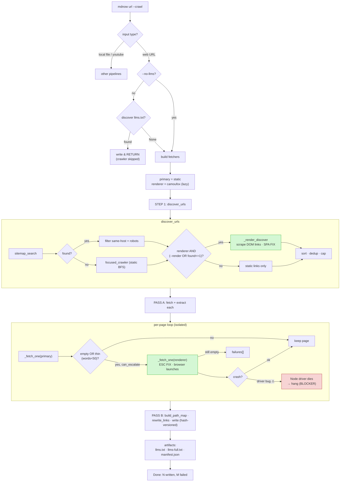

# Diagram: Crawl Mode Logic

How `mdnow <url> --crawl` turns a website into a tree of markdown files.
Includes the SPA fixes (render-aware discovery + per-page render escalation) and
the open Playwright driver-crash blocker.

## ASCII Version

```
                        mdnow <url> --crawl
                               │
                               ▼
                    ┌─────────────────────┐
                    │  cli.main            │
                    │  input-type fork     │  local file? youtube? → other paths
                    └──────────┬──────────┘
                               │ web URL
                               ▼
            ┌──────────────────────────────────────┐
            │  DISCOVERY GATE  (unless --no-llms)    │
            │  discover(url, crawl=True)             │
            │  → probe llms.txt / llms-full.txt      │
            └───────────┬───────────────┬───────────┘
                 found  │               │ None (e.g. nestjs)
                        ▼               ▼
                 write & RETURN   ┌──────────────────────────┐
                 (crawler skipped)│  build fetchers           │
                                  │  --render: primary=cam    │
                                  │  else: primary=static,    │
                                  │        renderer=cam(lazy) │
                                  └────────────┬─────────────┘
                                               ▼
        ╔══════════════════════════ crawl_site ══════════════════════════╗
        ║                                                                 ║
        ║  STEP 1 — discover_urls                                         ║
        ║  ┌───────────────────────────────────────────────────────┐    ║
        ║  │ sitemap_search ──found?──► filter same-host + robots    │    ║
        ║  │      │ empty                                            │    ║
        ║  │ focused_crawler (static BFS link-follow)                │    ║
        ║  │      │                                                  │    ║
        ║  │ if renderer AND (--render OR found<=1):   ◄── SPA FIX   │    ║
        ║  │      _render_discover → render page, scrape DOM <a>     │    ║
        ║  │      │            (nestjs: 1 → 12/139 links)            │    ║
        ║  │ sort · start-first · dedup · cap at max_pages           │    ║
        ║  └───────────────────────────────────────────────────────┘    ║
        ║                          │  URL set                             ║
        ║                          ▼                                      ║
        ║  STEP 2 — PASS A: fetch + extract each (isolated per page)      ║
        ║  ┌───────────────────────────────────────────────────────┐    ║
        ║  │ for url in urls:                                        │    ║
        ║  │   page = _fetch_one(primary, url)   static → extract    │    ║
        ║  │   thin = words < 50                                     │    ║
        ║  │   if (empty OR thin) AND can_escalate:   ◄── ESC FIX    │    ║
        ║  │        page = _fetch_one(renderer, url)  ⚠ browser here │    ║
        ║  │   None → failures[];  else → pages{canonical}          │    ║
        ║  └───────────────────────────────────────────────────────┘    ║
        ║                          │  pages{}                             ║
        ║                          ▼                                      ║
        ║  STEP 2 — PASS B: map · rewrite · write                         ║
        ║  ┌───────────────────────────────────────────────────────┐    ║
        ║  │ build_path_map(all canonical URLs)   URL → local .md   │    ║
        ║  │ rewrite_links(body, map)  internal+crawled → rel .md   │    ║
        ║  │ write(out/<path>, frontmatter, body)  hash-versioned   │    ║
        ║  └───────────────────────────────────────────────────────┘    ║
        ║                          │                                      ║
        ║  STEP 3 — artifacts:  llms.txt · llms-full.txt · manifest.json  ║
        ╚═════════════════════════════════════════════════════════════════╝
                                   │
                                   ▼
                 Done: N written, M failed → out/

  LEGEND
  ◄── SPA FIX / ESC FIX   my changes (discovery render + fetch escalation)
  ⚠ browser here          CamoufoxFetcher launches lazily on first render
  {canonical}             dedup key = canonical() URL identity (single source)
```

## Mermaid Version



## The one seam that matters

`Fetcher` is a Protocol: `fetch(url) -> FetchResult`. Static and Camoufox both
implement it, so **"escalate to render" = call `_fetch_one` with a different
fetcher** — nothing downstream (extractor, link-rewriter, writer) knows which
backend produced the bytes.

## Status

- 🟢 Discovery render-fallback — works (nestjs 1 → 12 pages)
- 🟢 Per-page escalation — works (fires on thin/empty)
- 🔴 **Blocker** — `CamoufoxFetcher.fetch` hits a Playwright Firefox driver crash
  (`pageError.location.url` TypeError) on SPA pages that throw uncaught JS errors;
  the reused browser makes one crash abort the whole run. This is below the
  `Fetcher` seam — the crawl logic above is unaffected.
